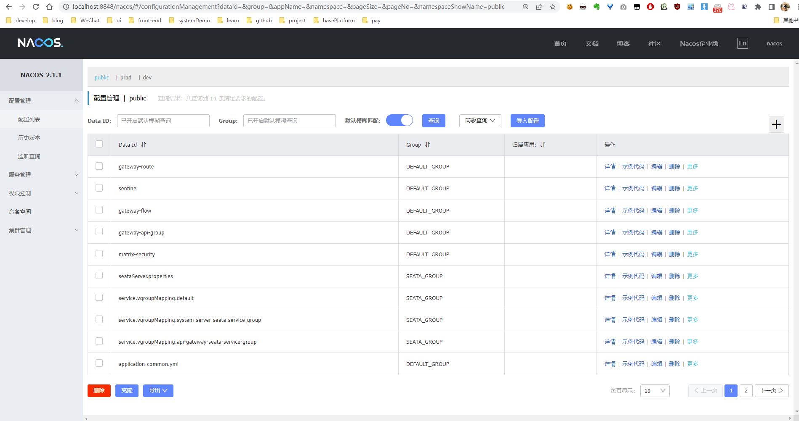
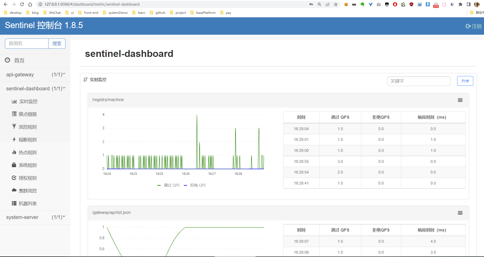
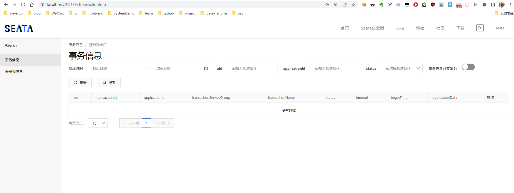
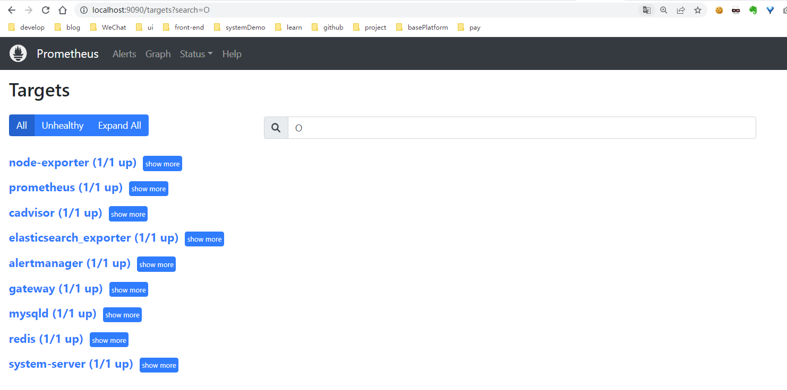

# 部署说明文档

deploy-dev 目录包含以下三个 compose 配置：

- `docker-compose.yml` — 基础中间件部署配置（mysql/redis/nacos/sentinel/seata/xxl-job）
- `docker-prometheus.yml` — 监控栈部署配置（elasticsearch/skywalking/prometheus/grafana/exporters）
- `app/docker-compose.yml` — 微服务应用部署配置（gateway/resource/system/admin）

以上三个配置公用 `matrix_cloud` 网络，开发时直接使用 hostname 访问，不需要频繁修改本地 IP。

- docker compose 的环境变量在 [.env](./.env) 中
- 各容器的环境变量可在 [env](./env) 文件夹下查看
- 微服务应用的环境变量在 [app/.env](./app/.env) 和 [app/dev.env](./app/dev.env) 中

## 快速启动

```bash
# 启动基础中间件
docker-compose up -d

# 启动监控栈（可选）
docker-compose -f docker-prometheus.yml up -d

# 启动微服务应用（需先构建镜像）
cd app && docker-compose up -d
```

管理脚本 [manage.sh](./manage.sh) 支持 `up/down/restart/ps/logs/clean` 命令，可按组件选择操作。

---

## docker-compose.yml — 基础中间件

包含：mysql, redis, nacos, sentinel, seata-server + seata-config-init, xxl-job-admin

> 具体版本查看 [.env 文件](./.env)，可自行更改，注意不同版本的配置可能有所不同

### mysql

MySQL 8.0.30，使用官方镜像 + 初始化脚本挂载方式。

[mysql-init/](./mysql-init/) 目录下的 SQL 文件会自动在首次启动时执行：

- [nacos.sql](./mysql-init/nacos.sql) — 创建 nacos_config 数据库
- [seata.sql](./mysql-init/seata.sql) — 创建 seata 数据库
- [tables_xxl_job.sql](./mysql-init/tables_xxl_job.sql) — 创建 xxl_job 数据库
- [matrix.sql](./mysql-init/matrix.sql) — 创建 matrix 业务数据库
- [undolog.sql](./mysql-init/undolog.sql) — 创建 undo_log 表（Seata AT 模式客户端）

默认端口 3306，默认 root 密码：matrix，默认创建用户：nacos/nacos

### redis

配置文件：[redis/conf/redis.conf](./redis/conf/redis.conf)

默认端口：6379，默认密码：matrix

> 如果提示无权限，需要给 redis/data 目录授予 777 权限

### nacos

- 版本：v3.1.1
- UI 地址：http://localhost:8848/nacos
- 默认账号：nacos/nacos

依赖 mysql 健康检查，使用外部 MySQL 存储。

Nacos 初始化由 mysql-init/nacos.sql 自动完成，修改 [env/nacos-standlone-mysql.env](./env/nacos-standlone-mysql.env) 中 mysql 相关配置。

> Nacos 2.0+ 新增 gRPC 通信，除主端口 8848 外还需开放 9848、9849 端口。

### sentinel

- 版本：1.8.5
- UI 地址：http://localhost:8088
- 默认账号密码：sentinel/sentinel

使用第三方镜像（自动集成 nacos 数据源），规则持久化到 nacos。

> gateway 集成 sentinel 时，需添加 JVM 参数 `-Dcsp.sentinel.app.type=1`

### seata-server

- 版本：2.5.0
- UI 地址：http://localhost:7091
- 默认账号密码：seata/seata

使用 nacos 配置/注册中心，db 存储模式，默认 AT 模式。

`seata-config-init` 容器会自动将 [seata/seataServer.properties](./seata/seataServer.properties) 推送到 nacos。

配置文件映射：
- [seata/application.yml](./seata/application.yml) — 服务端配置
- [seata/seataServer.properties](./seata/seataServer.properties) — Nacos 配置数据
- [seata/logback-spring.xml](./seata/logback-spring.xml) — 日志配置

MySQL 自动初始化 [mysql-init/seata.sql](./mysql-init/seata.sql) 创建 seata 数据库和表。

> 由于使用 docker 部署，seata 注册到 nacos 的 IP 为容器 IP，通过 `SEATA_IP` 环境变量指定实际 IP

**客户端配置：** seata 分组默认以 `spring.application.name` + `-seata-service-group` 拼接。需在 nacos 增加 dataid 为 `{服务名}-seata-service-group`，group 为 `SEATA_GROUP`，值为 seata-server 集群名称（默认 `default`）。

### xxl-job-admin

- 版本：3.3.1
- UI 地址：http://localhost:8090/xxl-job-admin
- 默认账号：admin/123456

依赖 mysql 健康检查。配置文件：[xxl-job/application.properties](./xxl-job/application.properties)

---

## docker-prometheus.yml — 监控栈

使用 `default` 网络（与 docker-compose.yml 的 `matrix_cloud` 网络隔离，通过 host 网络访问应用服务）。

包含：elasticsearch, setup（ES 用户初始化）, skywalking-oap + skywalking-ui, prometheus + grafana, node-exporter, cadvisor, mysqld-exporter, redis_exporter, alertmanager

### elasticsearch

- 版本：7.17.10
- 单节点模式，安全认证已启用

setup 容器会自动创建用户（logstash_internal, kibana_system, metricbeat_internal 等）。

配置文件：[elasticsearch/config/elasticsearch.yml](./elasticsearch/config/elasticsearch.yml)

> 如果 ES data/logs 目录提示无权限，需要授予 777 权限

### SkyWalking

- APM 版本：9.6.0
- UI 地址：http://localhost:8080
- Java Agent：项目根目录 skywalking-agent/，Jib 构建时自动注入镜像

skywalking-oap 使用 nacos 集群发现、elasticsearch 存储。配置文件：[skywalking/config/application.yml](./skywalking/config/application.yml)

**Agent 配置：** gateway 应用的 agent 需额外添加 `apm-spring-cloud-gateway` 和 `apm-spring-webflux` 插件（从 optional-plugins 复制到 plugins）。

```shell
java -javaagent:/path/to/skywalking-agent/skywalking-agent.jar -jar yourApp.jar
```

环境变量：`SW_AGENT_NAME=yourAppName`，`SW_AGENT_COLLECTOR_BACKEND_SERVICES=host:11800`

开启 SQL 参数显示：agent.config 中 `plugin.jdbc.trace_sql_parameters` 设置为 true。

### prometheus + grafana

配置文件：[prometheus/prometheus.yml](./prometheus/prometheus.yml)

采集目标：prometheus, cadvisor, node-exporter, alertmanager, mysqld-exporter, redis_exporter, 应用服务 `/actuator/prometheus` 端点。

告警规则：[prometheus/rules/](./prometheus/rules/)，邮件配置：[prometheus/alertmanager.yml](./prometheus/alertmanager.yml)（需修改 SMTP 信息）。

**Grafana Dashboard 导入 ID：**

| 面板 | ID |
|------|-----|
| node | 1860 |
| docker | 893 |
| redis | 11835 |
| mysql | 7362 |
| elasticsearch | 6483 |
| JVM | 4701 |
| springboot | 11378 |

更多查看 https://grafana.com/grafana/dashboards

---

## app/docker-compose.yml — 微服务应用

包含：matrix-gateway（9001）, matrix-resource（9003）, matrix-system（9004）, matrix-admin（9002）

每个服务自动加载 SkyWalking agent，挂载日志目录。

管理脚本：[app/docker.sh](./app/docker.sh) 支持 start/stop/restart（全部或单个服务）。

版本管理：[app/setenv.sh](./app/setenv.sh) 更新 VERSION 变量。

环境变量配置：
- [app/.env](./app/.env) — 镜像仓库地址、版本号、本地 IP
- [app/dev.env](./app/dev.env) — Nacos 地址、SkyWalking 地址、JVM 参数、调试端口

> WSL2 + Docker Desktop 环境下，应用注册到 nacos 的 IP 为容器 IP，内部服务间通信不受影响，但外部访问可能需要配置。

---

## 其他组件

### rocketmq

- 版本：5.3.4

在 docker-compose.yml 中已注释，取消注释即可启用。配置：[rocketmq/broker1/conf/broker.conf](./rocketmq/broker1/conf/broker.conf)

### nginx 反向代理

[nginx/](./nginx/) 目录提供反向代理配置，代理到 gateway 服务。启动脚本：[nginx/start.sh](./nginx/start.sh)

### filebeat 日志采集

[filebeat/](./filebeat/) 目录提供 filebeat 配置，采集业务日志输出到 Kafka。重启脚本：[filebeat/fbeat_restart.sh](./filebeat/fbeat_restart.sh)

### 环境准备脚本

[script/](./script/) 目录提供主机环境准备脚本：

- [dockerSetup.sh](./script/dockerSteup.sh) — CentOS Docker + docker-compose 安装
- [repo.sh](./script/repo.sh) — CentOS yum 源替换为清华镜像
- [fishSetup.sh](./script/fishSteup.sh) — 安装 fish shell

### Gateway API Endpoints

- `/actuator/gateway/routes` GET — 获取路由列表
- `/actuator/gateway/routes/{id}` GET/POST/DELETE — 查看/增加/删除路由
- `/actuator/gateway/refresh` POST — 路由刷新
- `/actuator/gateway/globalfilters` GET — 全局过滤器列表
- `/actuator/gateway/routefilters` GET — 路由过滤器工厂列表

---

## 截图展示

- nacos
  

- sentinel
  

- seata
  

- prometheus
  
